1.git config --global user.name
syntax:git config --global user.name "Your Name"
purpose:sets the username globally for all repositories

2.git config --global user.email
syntax:git config --global user.email"your@email.com"
purpose: sets email globally for commit identification

3. git config --list
syntax:git config --list
Purpose:
Displays all configured Git settings.
Example:
git config --list

4. git config --unset
Syntax:
git config --unset user.name
Purpose:
Removes a configuration value.
Example:
git config --unset user.name

5. git init
Syntax:
git init
Purpose:
Initializes a new Git repository.
Example:
git init

6. git clone
Syntax:
git clone <repository-url>
Purpose:
Creates a copy of a remote repository.
Example:
git clone https://github.com//project.git
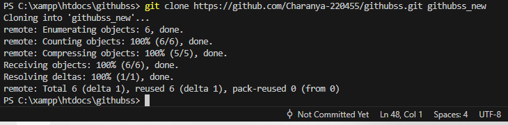

7.git clone --branch
syntax:
git clone --branch branch-name repository-url
purpose:
Clones only a specific branch
Example:
git clone --branch main https://github.com/user/project.git
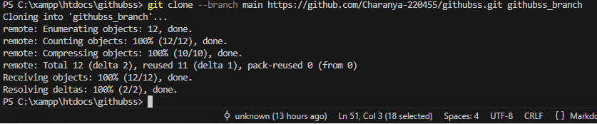

8.git clone --depth
syntax:
git clone --depth number repository-url
purpose:
Clones only limited commit history.
Example:
git clone --depth 1 https://github.com/user/project.git
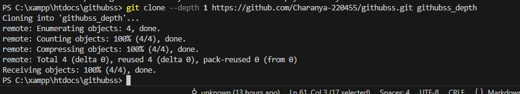

#repository status and inspection
9.git status
syntax:
git status
purpose:
shows current state of fies(modified,untraked,staged)
Example:
git status
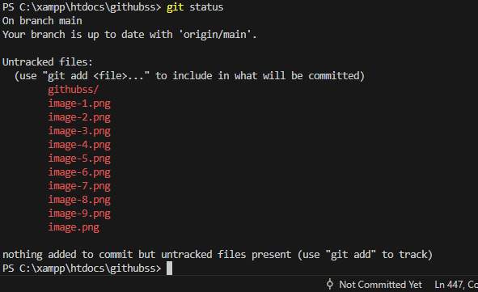

10.git log
syntax: 
git log
purpose:
Shows commit history.
ex: git log
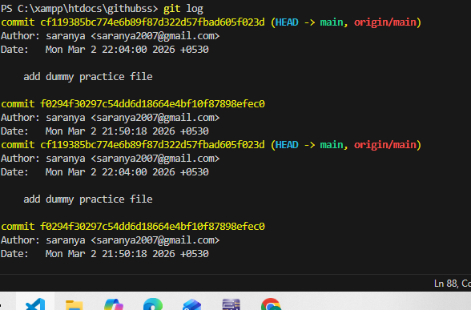

11.git log --oneline
syntax:
git log --oneline
purpose:
Shows commit hostory in short format.
Ex: git log --oneline
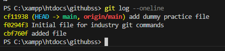

12.git log --graph
syntax:
git log --graph
purpose:
shows commit history with branch structure
Ex:
git log --graph --oneline
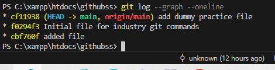

13.git show
syntax:
git show
purpose:
displays details of a commit.
Ex:git show
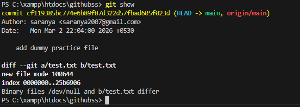

14.git diff
syntax:
git diff
Purpose
Shows changes between working directory and last commit.
Example
git diff
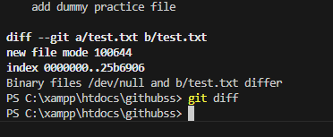

15.git diff --staged
Syntax
git diff --staged
Purpose
Shows the changes that are already added to the staging area.
Example
git diff --staged

16.git blame
Syntax
git blame <file-name>
Purpose
Shows who last modified each line of a file.
Example
git blame git_industry_commands.md
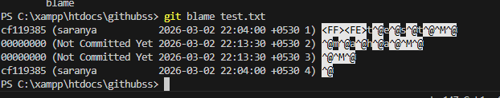

17.git reflog
Syntax
git reflog
Purpose
Shows the history of reference changes such as commits, resets and checkouts.
Example
git reflog
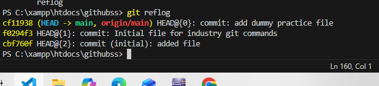

18.git shortlog
Syntax
git shortlog
Purpose
Displays a summarized commit history grouped by author.
Example
git shortlog
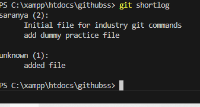

#file traking commands
19. git add
Syntax
git add <file-name>
Purpose
Adds a specific file to the staging area.
Example
git add git_industry_commands.md

20.git add .
Syntax
git add .
Purpose
Adds all modified and new files to the staging area.
Example
git add .
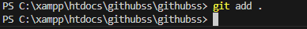

21. git add -p
Syntax
git add -p
Purpose
Allows you to interactively select parts of changes to stage.
Example
git add -p
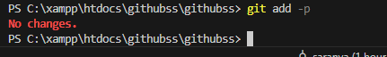

22.git restore
Syntax
git restore <file-name>
Purpose
Discards local changes and restores the file from last commit.
Example
git restore git_industry_commands.md

23.git restore --staged
Syntax
git restore --staged <file-name>
Purpose
Removes a file from the staging area without deleting changes.
Example
git restore --staged git_industry_commands.md

24.git rm
Syntax
git rm <file-name>
Purpose
Deletes a file and stages the deletion for the next commit.
Example
git rm test.txt
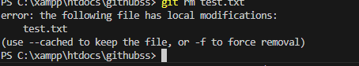

25. git mv
Syntax
git mv <old-name> <new-name>
Purpose
Renames or moves a file and stages the change automatically.
Example
git mv old.txt new.txt
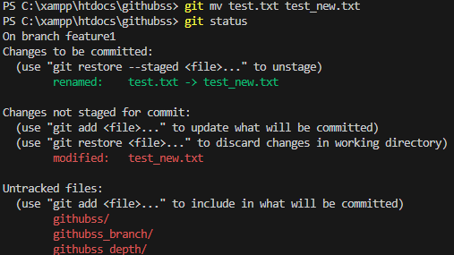

26. git commit
git commit
Purpose
Creates a new commit by opening the default editor to enter the commit message.
Example
git commit
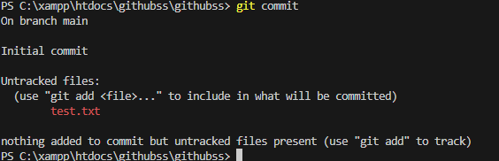

27.git commit -m
git commit -m "message"
Purpose
Creates a commit and saves the message directly from the terminal.
Example
git commit -m "Added commands file"

28. git commit --amend
Syntax
git commit --amend
Purpose
Edits the most recent commit by updating its content or message.
Example
git commit --amend
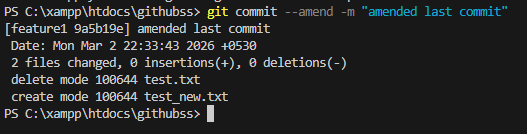

29. git commit --amend --no-edit
Syntax
git commit --amend --no-edit
Purpose
Updates the last commit without changing its commit message.
Example
git commit --amend --no-edit
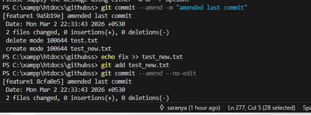

#Branch Management Commands
30. git branch
Syntax
git branch
Purpose
Displays all local branches in the repository.
Example
git branch
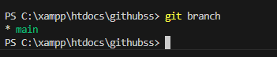

31.git branch -a
Syntax
git branch -a
Purpose
Displays both local and remote branches.
Example
git branch -a
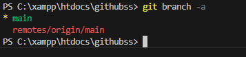

32. git branch -d
Syntax
git branch -d <branch-name>
Purpose
Deletes a local branch safely.
Example
git branch -d test
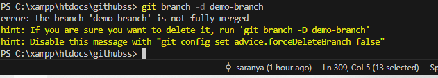

33.git branch -D
Syntax
git branch -D <branch-name>
Purpose
Deletes a local branch forcefully.
Example
git branch -D test
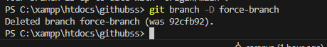

34. git checkout
Syntax
git checkout <branch-name>
Purpose
Switches the working directory to another branch.
Example
git checkout main
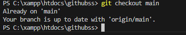

35. git checkout -b
Syntax
git checkout -b <branch-name>
Purpose
Creates a new branch and switches to it.
Example
git checkout -b feature1
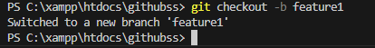

36. git switch
Syntax
git switch <branch-name>
Purpose
Switches to another branch using the modern command.
Example
git switch main
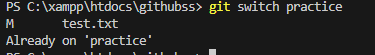

37.git switch -c
Syntax
git switch -c <branch-name>
Purpose
Creates and switches to a new branch.
Example
git switch -c demo
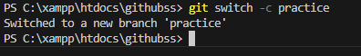

#merge and integration

38.git merge
Syntax
git merge <branch-name>
Purpose
Merges another branch into the current branch.
Example
git merge feature1
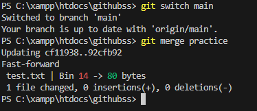

39.git merge --no-ff 
Syntax
git merge --no-ff <branch-name>
Purpose
Forces Git to create a merge commit even when fast-forward is possible.
Example
git merge --no-ff feature1
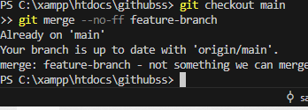

#Remote Repository Commands
40.git remote
Syntax
git remote
Purpose
Lists all configured remote repositories.
Example
git remote
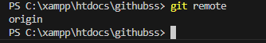

41.git remote -v
Syntax
git remote -v
Purpose
Displays remote names along with their URLs.
Example
git remote -v
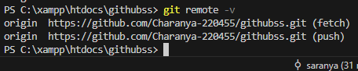

42. git remote add
Syntax
git remote add origin <url>
Purpose
Adds a new remote repository reference.
Example
git remote add origin https://github.com/user/repo.git
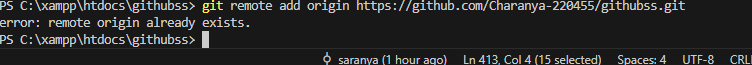

43.git remote remove
Syntax
git remote remove origin
Purpose
Removes a remote repository reference.
Example
git remote remove origin

44. git fetch
Syntax
git fetch
Purpose
Downloads changes from the remote without merging them.
Example
git fetch

45.git fetch --all
Syntax
git fetch --all
Purpose
Fetches updates from all configured remotes.
Example
git fetch --all
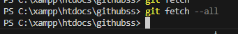

46.git pull
Syntax
git pull
Purpose
Fetches and merges remote changes into the current branch.
Example
git pull
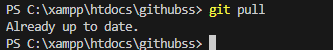

47.git pull --rebase
Syntax
git pull --rebase
Purpose
Fetches remote changes and reapplies your commits on top.
Example
git pull --rebase
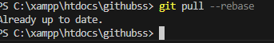

48.git push
Syntax
git push
Purpose
Uploads your local commits to the remote repository.
Example
git push

49.git push -u origin branch-name
Syntax
git push -u origin <branch-name>
Purpose
Pushes a branch and sets its upstream tracking branch.
Example
git push -u origin main

50.git push --force
Syntax
git push --force
Purpose
Forces the remote branch to match the local branch history.
Example
git push --force
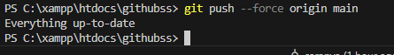

#stach commands
Syntax
git stash
Purpose
Temporarily saves your uncommitted changes.
Example
git stash
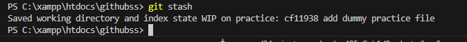

-git stash list
Syntax
git stash list
Purpose
Shows all saved stash entries.
Example
git stash list
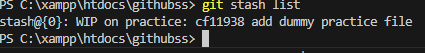

-git stash pop
Syntax
git stash pop
Purpose
Applies the latest stash and removes it from the list.
Example
git stash pop
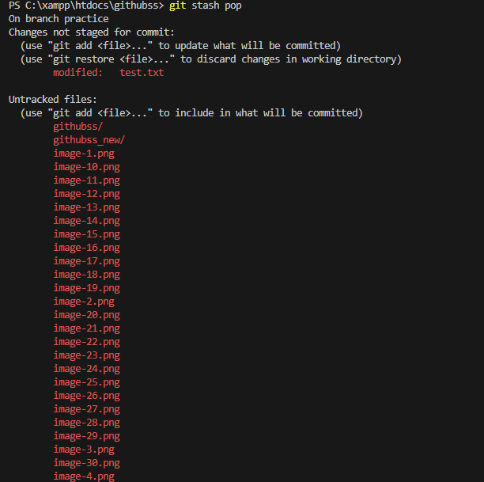

-git stash apply
Syntax
git stash apply
Purpose
Applies the latest stash without deleting it.
Example
git stash apply
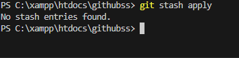

-git stash drop
Syntax
git stash drop
Purpose
Deletes the latest stash entry.
Example
git stash drop
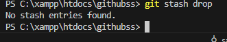

-git stash clear
Syntax
git stash clear
Purpose
Deletes all stash entries permanently.
Example
git stash clear
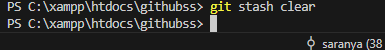

#Reset & Undo Commands

Syntax
git reset
Purpose
Unstages files without changing their content.
Example
git reset
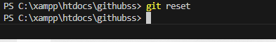

Syntax
git reset --soft HEAD~1
Purpose
Moves HEAD back while keeping changes staged.
Example
git reset --soft HEAD~1

Syntax
git reset --mixed HEAD~1
Purpose
Moves HEAD back and keeps changes unstaged.
Example
git reset --mixed HEAD~1
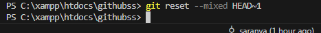

Syntax
git reset --hard HEAD~1
Purpose
Deletes commits and working directory changes permanently.
Example
git reset --hard HEAD~1
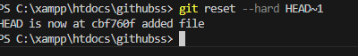

-git revert
Syntax
git revert <commit-id>
Purpose
Creates a new commit that reverses a previous commit.
Example
git revert HEAD
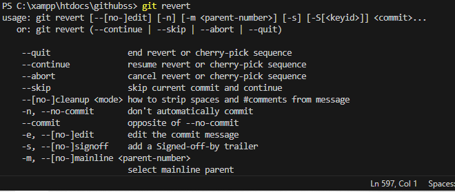

Syntax
git clean -f
Purpose
Deletes untracked files from the working directory.
Example
git clean -f

Syntax
git clean -fd
Purpose
Deletes untracked files and directories.
Example
git clean -fd

#Rebasing Commands
-git rebase
Syntax

git rebase <branch-name>

Purpose
Reapplies your commits on top of another branch.
Example
git rebase main
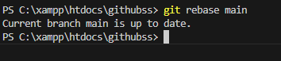

-git rebase -i
Syntax
git rebase -i HEAD~2

Purpose
Allows interactive editing of commits such as reorder or squash.

Example
git rebase -i HEAD~2

-git rebase --continue
Syntax
git rebase --continue

Purpose
Continues the rebase process after conflict resolution.

Example
git rebase --continue
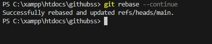

#: Cherry Pick & Patch
-git cherry-pick

Syntax
git cherry-pick <commit-id>

Purpose
Applies a specific commit to the current branch.

Example
git cherry-pick a1b2c3d
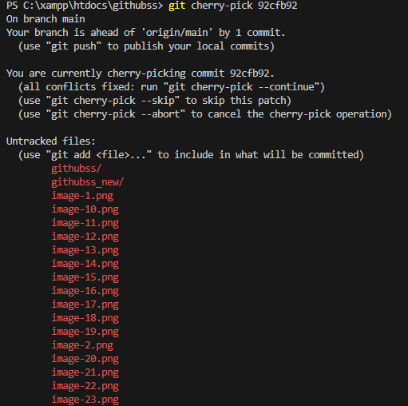

-git format-patch
Syntax
git format-patch -1 <commit-id>

Purpose
Creates a patch file from a commit.

Example
git format-patch -1 a1b2c3d
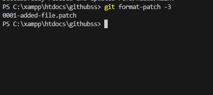

-git apply
Syntax
git apply <file.patch>

Purpose
Applies a patch without creating a commit.

Example
git apply fix.patch

-git am
Syntax
git am <file.patch>

Purpose
Applies a patch and creates a commit automatically.

Example
git am fix.patch

#Tagging Commands
-git tag
Syntax
git tag

Purpose
Lists all tags in the repository.

Example
git tag

-git tag -a
Syntax
git tag -a <tag-name> -m "message"

Purpose
Creates an annotated tag for a commit.

Example
git tag -a v1.0 -m "first release"

-git tag -d
Syntax
git tag -d <tag-name>

Purpose
Deletes a local tag.

Example
git tag -d v1.0

-git push origin --tags
Syntax
git push origin --tags

Purpose
Pushes all local tags to the remote repository.

Example
git push origin --tags

#Submodule Commands
-git submodule add
Syntax
git submodule add <url>

Purpose
Adds another repository as a submodule.

Example
git submodule add https://github.com/user/lib.git

-git submodule init
Syntax
git submodule init

Purpose
Initializes submodule configuration.

Example
git submodule init

-git submodule update
Syntax
git submodule update

Purpose
Updates submodule content to the recorded commit.

Example
git submodule update

#Debugging Commands
-git bisect
Syntax
git bisect

Purpose
Starts the binary search process to locate a faulty commit.

Example
git bisect

-git bisect start
Syntax
git bisect start

Purpose
Begins a bisect debugging session.

Example
git bisect start

-git bisect good
Syntax
git bisect good

Purpose
Marks the current commit as a good commit.

Example
git bisect good

-git bisect bad
Syntax
git bisect bad

Purpose
Marks the current commit as a bad commit.

Example
git bisect bad

