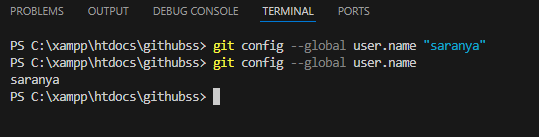
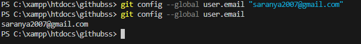
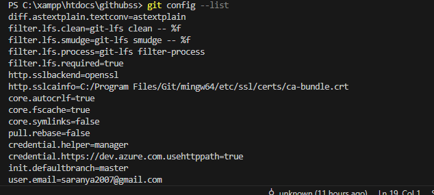
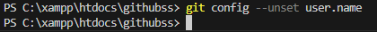
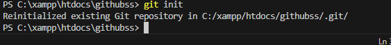
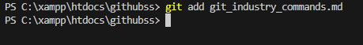
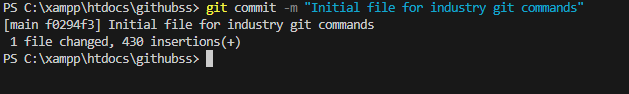
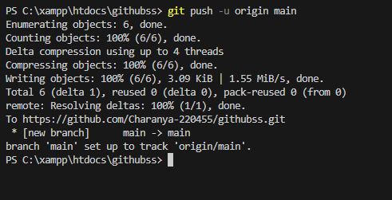
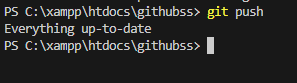

1.git config --global user.name
syntax:git config --global user.name "Your Name"
purpose:sets the username globally for all repositories
.png>)

2.git config --global user.email
syntax:git config --global user.email"your@email.com"
purpose: sets email globally for commit identification
-1.png>)
.png>)
3. git config --list
syntax:git config --list
Purpose:
Displays all configured Git settings.
Example:
git config --list

.png>)
4. git config --unset
Syntax:
git config --unset user.name
Purpose:
Removes a configuration value.
Example:
git config --unset user.name

.png>)
5. git init
Syntax:
git init
Purpose:
Initializes a new Git repository.
Example:
git init
.png>)
6. git clone
Syntax:
git clone <repository-url>
Purpose:
Creates a copy of a remote repository.
Example:
git clone https://github.com//project.git

7.git clone --branch
syntax:
git clone --branch branch-name repository-url
purpose:
Clones only a specific branch
Example:
git clone --branch main https://github.com/user/project.git

8.git clone --depth
syntax:
git clone --depth number repository-url
purpose:
Clones only limited commit history.
Example:
git clone --depth 1 https://github.com/user/project.git

#repository status and inspection
9.git status
syntax:
git status
purpose:
shows current state of fies(modified,untraked,staged)
Example:
git status

10.git log
syntax: 
git log
purpose:
Shows commit history.
ex: git log

11.git log --oneline
syntax:
git log --oneline
purpose:
Shows commit hostory in short format.
Ex: git log --oneline

12.git log --graph
syntax:
git log --graph
purpose:
shows commit history with branch structure
Ex:
git log --graph --oneline

13.git show
syntax:
git show
purpose:
displays details of a commit.
Ex:git show

14.git diff
syntax:
git diff
Purpose
Shows changes between working directory and last commit.
Example
git diff

15.git diff --staged
Syntax
git diff --staged
Purpose
Shows the changes that are already added to the staging area.
Example
git diff --staged

16.git blame
Syntax
git blame <file-name>
Purpose
Shows who last modified each line of a file.
Example
git blame git_industry_commands.md

17.git reflog
Syntax
git reflog
Purpose
Shows the history of reference changes such as commits, resets and checkouts.
Example
git reflog

18.git shortlog
Syntax
git shortlog
Purpose
Displays a summarized commit history grouped by author.
Example
git shortlog

#file traking commands
19. git add
Syntax
git add <file-name>
Purpose
Adds a specific file to the staging area.
Example
git add git_industry_commands.md

20.git add .
Syntax
git add .
Purpose
Adds all modified and new files to the staging area.
Example
git add .

